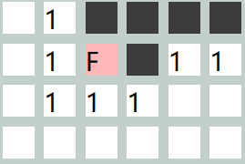
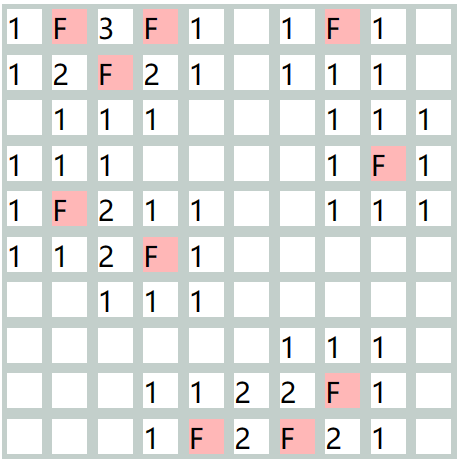
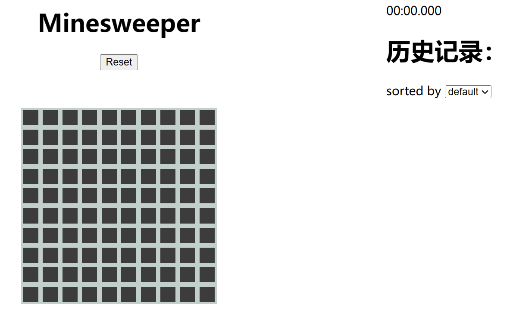

# 实验报告

###### 编程: 电子2304付博文 

###### 实验报告: 信息2301彭一城

###### PPT: 信计001许诗卿

## 扫雷(Minesweeper)

### 基本规则

对于每一个格子, 其数字代表周围3x3九宫格范围内雷的数量, 对于周围没有雷的格子, 我们以空格代替原有的0



对于未打开的格子, 玩家可以右键点击来在其上插旗, 以标记雷, 当所有的雷都被旗子标记且旗子的数量等于雷的数量时, 游戏胜利 



***

### 界面设计



整个页面分为4个部分, 名称, 游戏主体, 计时部分以及历史记录

#### 名称

该部分展示了游戏的名称(minesweeper)

#### 游戏主体

包含一个10*10的游戏格以及一个重新开始按钮`reset`

#### 计时部分

我们使用一个字符串来记录时间, 并实时更新

#### 历史记录

游戏的历史被记录在右侧的历史记录下, 并提供两个选项 (按照时间排序与默认排序)

***

### 具体实现

#### 界面设计

对于界面设计, 我们使用`flex`布局, 实现基本的用户界面

```html
<!DOCTYPE html>
<html lang="en">
<head>
  <meta charset="UTF-8">
  <meta name="viewport" content="width=device-width, initial-scale=1.0">
  <link rel="stylesheet" href="./style.css">
  <title>Document</title>
</head>
<body>
  <div class="container">
    <div class="game">
      <div id="header">
        <h1>Minesweeper</h1>
        <button id="reset" onclick="reset()">Reset</button>
        <!-- <button id="test" onclick="test()" style="margin: 5px;">Test</button> -->
      </div>
      <div id="maindiv">
        <div id="board"></div>
      </div>
    </div>
    <div class="record">
      <p id="timer"></p>
      <h1>历史记录：</h1>
      <label for="sort">sorted by</label>
      <select id="sort" onchange="sort()">
        <option value="default">default</option>
        <option value="time">time</option>
      </select>
        <ul id="records"></ul>
    </div>
  </div>
  <script src="./minesweeper.js"></script>
</body>
</html>
```

#### 游戏流程

在游戏的开始, 下列的变量将被初始化

```javascript
let startTime;
let timerInterval;
let records = [];

const timerDisplay = document.getElementById('timer');
const recordsList = document.getElementById('records');

var mines = [];
var matrix = [];
var clicked = [];
fcnt = 0;
err = 0;
isStart = false;
```

其中`startTime`, `timerInterval`, 是时间模块的变量, `records`, `recordsList`是记录模块的变量 , 剩下的`mines`, `matrix`, `clicked` 都是游戏场景的变量

此后场景初始化

```js
function __init__(){
  dom = document.getElementById("maindiv");
  for (var i = 0; i < 10; i++) {
    var row = document.createElement("div");
    row.className = "row";
    for (var j = 0; j < 10; j++) {
      var cell = document.createElement("div");
      cell.className = "cell";
      cell.id = i + "-" + j;
      cell.addEventListener('click', function() {
        click(this);
      });
      cell.addEventListener('contextmenu', function(event) {
        flag(this);
        event.preventDefault(); 
        });
      row.appendChild(cell);
    }
    dom.appendChild(row);
  }
  set();
}
```

```js
function set(){
  for (var i = 0; i < 10; i++) {
    mines[i] = [];
    for (var j = 0; j < 10; j++) {
      mines[i][j] = 0;
    }
  }
  num = 0
  for (;num < 10;) {
    var x = Math.floor(Math.random() * 10);
    var y = Math.floor(Math.random() * 10);
    if (mines[x][y] == 1) {
      continue;
    }
    mines[x][y] = 1;
    num++;
  }
  for (var i = 0; i < 10; i++) {
    matrix[i] = [];
    for (var j = 0; j < 10; j++) {
      matrix[i][j] = 0;
    }
  }
  var count = 0;
  for (var i = 0; i < 10; i++) {
    for (var j = 0; j < 10; j++) {
      if(mines[i][j] == 1){
        matrix[i][j] = -1;
        continue;
      }
      count = 0;
      for (var x = i - 1; x <= i + 1; x++) {
        for (var y = j - 1; y <= j + 1; y++) {
          if (x >= 0 && x < 10 && y >= 0 && y < 10) {
            count += mines[x][y];
          }
        }
      }
      matrix[i][j] = count;
    }
  }
  for (var i = 0; i < 10; i++) {
    clicked[i] = [];
    for (var j = 0; j < 10; j++) {
      clicked[i][j] = 0;
    }
  }
}
```

场景的每一个`cell`都是通过`appendchild`来的, 这样提高了复用性 (如提高难度)

其中每个`cell`都被绑定了监听函数

左键绑定`click()`

```js
function click(cell){
  var id = cell.id.split("-");
  var i = parseInt(id[0]);
  var j = parseInt(id[1]);
  cell.className = "cellclicked";
  clicked[i][j] = 1;
  if (!isStart) {
    isStart = true;
    startTimer();
  }
  if (mines[i][j] == 1) {
    cell.className = "cellbomb";
    alert("Game Over!");
    reset();
  } else {
    count = matrix[i][j];
    if(count == 0){
      dfs(i, j);
      cell.innerHTML = " ";
      return
    }
    cell.innerHTML = count;
  }
}
```

右键绑定`flag()`

```js
function flag(cell){
  var id = cell.id.split("-");
  var i = parseInt(id[0]);
  var j = parseInt(id[1]);
  if (cell.className == "cellflaged") {
    cell.className = "cell";
    cell.innerHTML = "";
    if(mines[i][j] == 1){
      fcnt--;
    }else{
      err --;
    }
  } else {
    cell.className = "cellflaged";
    cell.innerHTML = "F";
    if(mines[i][j] == 1){
      fcnt++;
    }else{
      err ++;
    }
    if (fcnt == 10 && err == 0) {
      alert("You Win!");
      stopTimer();
      recordTime();
    }
  }
}
```

如果点击的元素周围没有雷,他将自动扩散到周围所有没有雷的地方, 此处使用的算法是深度优先搜索`dfs()`

```js
function dfs(x,y){
  for (var i = x-1; i <= x+1; i++) {
    if(i<0 || i>=10){
      continue;
    }
    if (clicked[i][y] != 1){
      if(matrix[i][y] != -1){
        document.getElementById(i + "-" + y).click();
      }
    }
  }
  for (var i = y-1; i <= y+1; i++){
    if(i<0 || i>=10){
      continue;
    }
    if (clicked[x][i] != 1){
      if(matrix[x][i] != -1){
        document.getElementById(x + "-" + i).click();
      }
    }
  }
}
```

胜利判断

```js
if (cell.className == "cellflaged") {
    cell.className = "cell";
    cell.innerHTML = "";
    if(mines[i][j] == 1){
      fcnt--;
    }else{
      err --;
    }
  } else {
    cell.className = "cellflaged";
    cell.innerHTML = "F";
    if(mines[i][j] == 1){
      fcnt++;
    }else{
      err ++;
    }
    if (fcnt == 10 && err == 0) {
      alert("You Win!");
      stopTimer();
      recordTime();
    }
  }
```

在`flag()`函数中, 如果用户插旗格是地雷格, `fcnt++`, 反之`err++`, 当且仅当用户找到所有的旗子并且只插了十个旗子时, 游戏胜利

而后时间停止, 时间被记录到`records`里

失败判断

```js
if (mines[i][j] == 1) {
    cell.className = "cellbomb";
    alert("Game Over!");
    reset();
  }
```

如果用户点击了雷格子, 将被判定为失败, 并且重新开始

最后如果用户想要再来一局, 可以点击`reset`按钮重新开始

```js
function reset(){
  for (var i = 0; i < 10; i++) {
    for (var j = 0; j < 10; j++) {
      var cell = document.getElementById(i + "-" + j);
      cell.className = "cell";
      cell.innerHTML = "";
      clicked[i][j] = 0;
    }
  }
  isStart = false;
  stopTimer();
  timerDisplay.textContent = '00:00.000';
  fcnt = 0;
  for (var i = 0; i < 10; i++) {
    mines[i] = [];
    for (var j = 0; j < 10; j++) {
      mines[i][j] = 0;
    }
  }
  num = 0;
  for (;num < 10;) {
    var x = Math.floor(Math.random() * 10);
    var y = Math.floor(Math.random() * 10);
    if (mines[x][y] == 1) {
      continue;
    }
    mines[x][y] = 1;
    num++;
  }
  matrix = [];
  for (var i = 0; i < 10; i++) {
    matrix[i] = [];
    for (var j = 0; j < 10; j++) {
      matrix[i][j] = 0;
    }
  }
  count = 0;
  for (var i = 0; i < 10; i++) {
    for (var j = 0; j < 10; j++) {
      if(mines[i][j] == 1){
        matrix[i][j] = -1;
        continue;
      }
      count = 0;
      for (var x = i - 1; x <= i + 1; x++) {
        for (var y = j - 1; y <= j + 1; y++) {
          if (x >= 0 && x < 10 && y >= 0 && y < 10) {
            count += mines[x][y];
          }
        }
      }
      matrix[i][j] = count;
    }
  }
}
```

***

### 附件

index.html

```html
<!DOCTYPE html>
<html lang="en">
<head>
  <meta charset="UTF-8">
  <meta name="viewport" content="width=device-width, initial-scale=1.0">
  <link rel="stylesheet" href="./style.css">
  <title>Document</title>
</head>
<body>
  <div class="container">
    <div class="game">
      <div id="header">
        <h1>Minesweeper</h1>
        <button id="reset" onclick="reset()">Reset</button>
        <button id="test" onclick="test()" style="margin: 5px;">Test</button>
      </div>
      <div id="maindiv">
        <div id="board"></div>
      </div>
    </div>
    <div class="record">
      <p id="timer"></p>
      <h1>历史记录：</h1>
      <label for="sort">sorted by</label>
      <select id="sort" onchange="sort()">
        <option value="default">default</option>
        <option value="time">time</option>
      </select>
        <ul id="records"></ul>
    </div>
  </div>
  <script src="./minesweeper.js"></script>
</body>
</html>
```

minesweeper.js

```js
function __init__(){
  dom = document.getElementById("maindiv");
  for (var i = 0; i < 10; i++) {
    var row = document.createElement("div");
    row.className = "row";
    for (var j = 0; j < 10; j++) {
      var cell = document.createElement("div");
      cell.className = "cell";
      cell.id = i + "-" + j;
      cell.addEventListener('click', function() {
        click(this);
      });
      cell.addEventListener('contextmenu', function(event) {
        flag(this);
        event.preventDefault(); 
        });
      row.appendChild(cell);
    }
    dom.appendChild(row);
  }
  set();
}

function flag(cell){
  var id = cell.id.split("-");
  var i = parseInt(id[0]);
  var j = parseInt(id[1]);
  if (cell.className == "cellflaged") {
    cell.className = "cell";
    cell.innerHTML = "";
    if(mines[i][j] == 1){
      fcnt--;
    }else{
      err --;
    }
  } else {
    cell.className = "cellflaged";
    cell.innerHTML = "F";
    if(mines[i][j] == 1){
      fcnt++;
    }else{
      err ++;
    }
    if (fcnt == 10 && err == 0) {
      alert("You Win!");
      stopTimer();
      recordTime();
    }
  }
}

function click(cell){
  var id = cell.id.split("-");
  var i = parseInt(id[0]);
  var j = parseInt(id[1]);
  cell.className = "cellclicked";
  clicked[i][j] = 1;
  if (!isStart) {
    isStart = true;
    startTimer();
  }
  if (mines[i][j] == 1) {
    cell.className = "cellbomb";
    alert("Game Over!");
    reset();
  } else {
    count = matrix[i][j];
    if(count == 0){
      dfs(i, j);
      cell.innerHTML = " ";
      return
    }
    cell.innerHTML = count;
  }
}

function dfs(x,y){
  for (var i = x-1; i <= x+1; i++) {
    if(i<0 || i>=10){
      continue;
    }
    if (clicked[i][y] != 1){
      if(matrix[i][y] != -1){
        document.getElementById(i + "-" + y).click();
      }
    }
  }
  for (var i = y-1; i <= y+1; i++){
    if(i<0 || i>=10){
      continue;
    }
    if (clicked[x][i] != 1){
      if(matrix[x][i] != -1){
        document.getElementById(x + "-" + i).click();
      }
    }
  }
}

function set(){
  for (var i = 0; i < 10; i++) {
    mines[i] = [];
    for (var j = 0; j < 10; j++) {
      mines[i][j] = 0;
    }
  }
  num = 0
  for (;num < 10;) {
    var x = Math.floor(Math.random() * 10);
    var y = Math.floor(Math.random() * 10);
    if (mines[x][y] == 1) {
      continue;
    }
    mines[x][y] = 1;
    num++;
  }
  for (var i = 0; i < 10; i++) {
    matrix[i] = [];
    for (var j = 0; j < 10; j++) {
      matrix[i][j] = 0;
    }
  }
  var count = 0;
  for (var i = 0; i < 10; i++) {
    for (var j = 0; j < 10; j++) {
      if(mines[i][j] == 1){
        matrix[i][j] = -1;
        continue;
      }
      count = 0;
      for (var x = i - 1; x <= i + 1; x++) {
        for (var y = j - 1; y <= j + 1; y++) {
          if (x >= 0 && x < 10 && y >= 0 && y < 10) {
            count += mines[x][y];
          }
        }
      }
      matrix[i][j] = count;
    }
  }
  for (var i = 0; i < 10; i++) {
    clicked[i] = [];
    for (var j = 0; j < 10; j++) {
      clicked[i][j] = 0;
    }
  }
}

function reset(){
  for (var i = 0; i < 10; i++) {
    for (var j = 0; j < 10; j++) {
      var cell = document.getElementById(i + "-" + j);
      cell.className = "cell";
      cell.innerHTML = "";
      clicked[i][j] = 0;
    }
  }
  isStart = false;
  stopTimer();
  timerDisplay.textContent = '00:00.000';
  fcnt = 0;
  for (var i = 0; i < 10; i++) {
    mines[i] = [];
    for (var j = 0; j < 10; j++) {
      mines[i][j] = 0;
    }
  }
  num = 0;
  for (;num < 10;) {
    var x = Math.floor(Math.random() * 10);
    var y = Math.floor(Math.random() * 10);
    if (mines[x][y] == 1) {
      continue;
    }
    mines[x][y] = 1;
    num++;
  }
  matrix = [];
  for (var i = 0; i < 10; i++) {
    matrix[i] = [];
    for (var j = 0; j < 10; j++) {
      matrix[i][j] = 0;
    }
  }
  count = 0;
  for (var i = 0; i < 10; i++) {
    for (var j = 0; j < 10; j++) {
      if(mines[i][j] == 1){
        matrix[i][j] = -1;
        continue;
      }
      count = 0;
      for (var x = i - 1; x <= i + 1; x++) {
        for (var y = j - 1; y <= j + 1; y++) {
          if (x >= 0 && x < 10 && y >= 0 && y < 10) {
            count += mines[x][y];
          }
        }
      }
      matrix[i][j] = count;
    }
  }
}

function startTimer() {
    startTime = Date.now();
    timerInterval = setInterval(updateTimer, 10); // 更新频率改为10毫秒
}

function stopTimer() {
    clearInterval(timerInterval);
    updateTimer();
}

function updateTimer() {
    const elapsedTime = new Date(Date.now() - startTime);
    const minutes = elapsedTime.getUTCMinutes();
    const seconds = elapsedTime.getUTCSeconds();
    const milliseconds = elapsedTime.getUTCMilliseconds();
    timerDisplay.textContent = `${minutes.toString().padStart(2, '0')}:${seconds.toString().padStart(2, '0')}.${milliseconds.toString().padStart(3, '0')}`;
}

function recordTime() {
    records.push(timerDisplay.textContent);
    updateRecords(records);
}

function sort(){
  let record = [];
  copy(record, records);
  choose = document.getElementById("sort").value;
  if(choose == "time"){
    record.sort();
  }
  updateRecords(record);
}

function updateRecords(list){
  while (recordsList.firstChild) {
    recordsList.removeChild(recordsList.firstChild);
  }
  for (var i = 0; i < list.length; i++) {
    const newRecordItem = document.createElement('li');
    newRecordItem.textContent = list[i];
    recordsList.appendChild(newRecordItem);
  }

}

function copy(copylist, orilist){
  for(var i = 0; i < orilist.length; i++){
    copylist.push(orilist[i]);
  }
}

function test(){
  for(i = 0; i < 10; i++){
    for(j = 0; j < 10; j++){
      if(mines[i][j] == 1){
        flag(document.getElementById(i + "-" + j));
      }else{
        click(document.getElementById(i + "-" + j));
      }
    }
  }
}

let startTime;
let timerInterval;
let records = [];

const timerDisplay = document.getElementById('timer');
const recordsList = document.getElementById('records');

var mines = [];
var matrix = [];
var clicked = [];
fcnt = 0;
err = 0;
isStart = false;

__init__();
console.log(mines);
console.log(matrix);
```

style.css

```css
*{
  user-select: none;
}

.container{
  display: grid;
  grid-template-columns: 1fr 1fr;
  margin: auto;
  width: 100%;
  height: 100%;
}
.game {
  display: flex;
  flex-direction: column;
  justify-content: center;
  align-items: center;
}
#header {
  display: flex;
  flex-direction: column;
  justify-content: center;
  align-items: center;
  margin-bottom: 50px;
}
#maindiv{
  background-color: rgb(195, 207, 203);
  margin: auto;
  display: flex;
  flex-direction: column;
}
.cell{
  background-color: rgb(60, 60, 60);
  width: 20px;
  height: 20px;
  margin: 3px;
  display: flex;
  align-items: center;
}
.cell:hover{
  background-color: rgb(255, 255, 255);
}
.cellclicked{
  width: 20px;
  height: 20px;
  margin: 3px;
  background-color: rgb(255, 255, 255);
}
.cellbomb{
  width: 20px;
  height: 20px;
  margin: 3px;
  background-color: rgb(255, 0, 0);
}
.row{
  display: flex;
  flex-direction: row;
}
.cellflaged{
  width: 20px;
  height: 20px;
  margin: 3px;
  background-color: rgb(255, 183, 183);
}
```

***